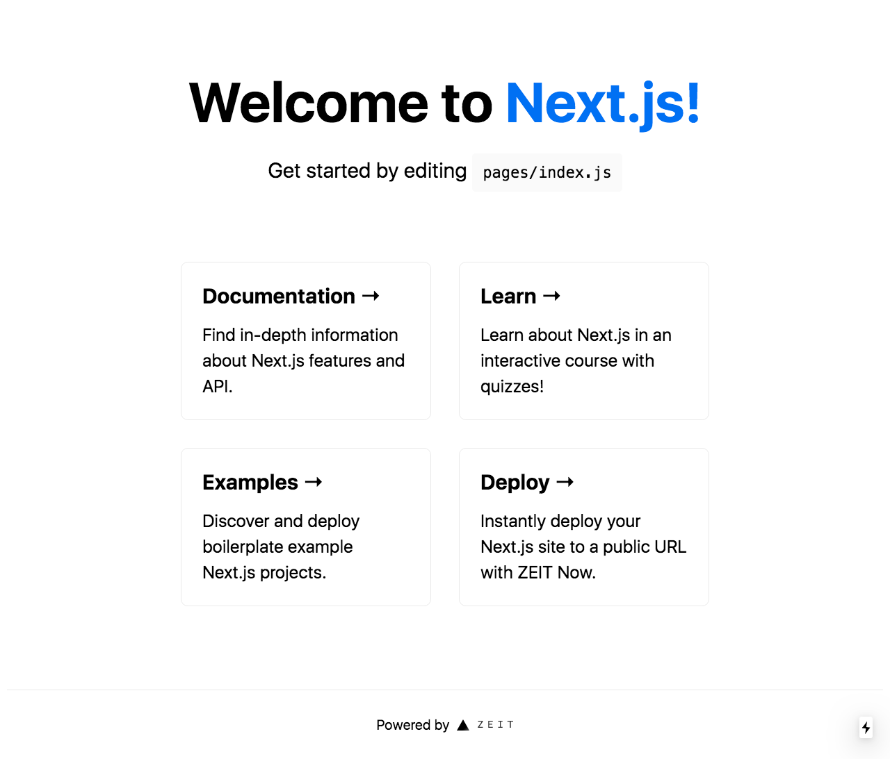

Docker is a powerful tool that is widely used today for deployment,
continuous integration (CI) and other DevOps use cases.

I increasingly turn to Docker for my development workflow. I've found the 
benefits compelling; here are a few:

:white_check_mark: Consistent & replicable development environment.  
:white_check_mark: Simple commands to set up, start and stop your project.  
:white_check_mark: Language-agnostic.  
:white_check_mark: Easily extended to add CI & deployment at any scale.

In this tutorial, we will use the basic Next.js template to create a dockerized node.js application.

## Steps

My process involves the following sets:

:one: Write Dockerfile and build image.  
:two: Configure docker-compose.  
:three: Configure Makefile

## Dockerfile

Let's take as an example Dockerizing a project created with 
[Next.js](https://nextjs.org).

### Create Next.js app

Let's use docker to create our next.js app:

```bash
$ mkdir next-project
$ cd next-project
$ docker run -it -w /app -v "$(pwd):/app" node:latest yarn create next-app
> ✔ What is your project named? … next-project
> ✔ Pick a template › Default starter app
> Creating a new Next.js app in /next-project.
$ mv next-project app
```

I used `next-project`; use the name of your project here and elsewhere.

Let's break that down:

`docker run`: Run a one-off command in a Docker image.  
`-it`: Run the command interactively.  
`-w /app`: Use `/app` as the working directory.  
`-v "$(pwd):/app"`: Mount the present working directory (pwd) as a volume at /app.  
`node:latest`: This is the docker image to use; the latest node image.  
`yarn create next-app`: The command to run.  
`mv next-project app`: Move the project into the app folder. This make dockerizing easier.  

This leaves us with a brand new Next.js app in `./next-project/app` folder.

### Write Dockerfile and build image

Our Dockerfile needs to do a few things:

:point_right: Add package.json and install dependencies.  
:point_right: Add codebase.  
:point_right: Build Next.js app.  
:point_right: Start Next.js app.

It looks like this:

```Dockerfile
# ./next-project/app/Dockerfile
FROM node:latest

WORKDIR /app

COPY package.json /app
RUN yarn

COPY . /app

RUN yarn build

ENTRYPOINT ["yarn"]
CMD ["start"]
```

Let's build the image:

```bash
$ cd app
$ docker build . -t next-project:latest
> Step 1/8 : FROM node:latest
> # ...
> Successfully tagged next-project:latest
```

### Start the app

Next, let's use the image to start a container running the app:

```bash
$ docker create --name next_project_app next-project:latest
$ docker start next_project_app
$ docker logs next_project_app
> yarn run v1.21.1
> $ next start
> > Ready on http://localhost:3000
```

Great! Now stop and remove the container:

```bash
$ docker rm -f next_project_app
```

That's s'well! Still, it's a lot to type every time we want to build the image, or start the app.

Make targets streamline these and other common tasks.

## Adding Make targets

First, let's create a docker-compose configuration for starting and stopping our service:

```yml
# ./next-project/docker/docker-compose.yml
version: '3.7'
services:
  # `app` is the name of our service
  app:
    # $DOCKER_IMAGE comes from our Makefile.
    image: ${DOCKER_IMAGE}
    # Make the port configurable. Important as many libraries default to 3000.
    ports:
      - ${PORT}:3000
    # We'll run the dev command here. For production deployment we'll change this.
    command: ["dev"]
    # Mount our codebase as a volume, so we can edit code in realtime.
    volumes:
      - ./app:/app
```

Now, let's add targets to build, start and stop our service. The `export` statements help remove repetition. Change `PROJECT`, for example, for your project.

```Makefile
# ./next-project/docker/Makefile
export PROJECT=next-project
export DOCKER_IMAGE=${PROJECT}:latest
export SERVICE=app
export PORT ?= 3000

define COMPOSE_CMD
docker-compose -p ${PROJECT} \
  --project-directory=.. \
  -f ./docker-compose.yml
endef

build:
  docker build ../${SERVICE} -t ${DOCKER_IMAGE}

start:
   ${COMPOSE_CMD} up -d ${SERVICE}

logs:
   ${COMPOSE_CMD} logs -f ${SERVICE}

stop:
    ${COMPOSE_CMD} down --remove-orphans
```

To use them, run the following from the root of your project:

```bash
$ make -C docker build start logs
> make: Entering directory '/root/next-project/docker'
> docker build ../app -t next-project:latest
> Sending build context to Docker daemon  66.14MB
> Step 1/8 : FROM node:latest
> # ...
> Successfully tagged next-project:latest
> docker-compose -p next-project --project-directory=.. -f ./docker-compose.yml up -d app
> Creating network "next-project_default" with the default driver
> Creating next-project_app_1 ... done
> docker-compose -p next-project --project-directory=.. -f ./docker-compose.yml logs -f app
> Attaching to next-project_app_1
> app_1  | yarn run v1.21.1
> app_1  | $ next dev
> # ...
> app_1  | [ ready ] compiled successfully - ready on http://localhost:3000
```

And, voila! Our application is running in a docker container.



### Add a console target 

Because we mounted our codebase as a volume in the `docker-compose.yml` file, we can edit the code of our application as if it was not dockerized. But how do we access a console for debugging or running one-off commands?

We can modi
## Conclusion

Dockerizing your application is just the beginning of the benefits of docker. We can also use docker to start additional services, such as relational databases, in-memory datastores, and even other applications required by our front-end Next.js application.

In the future we will learn to create a backend service connected to a database with Prism.js and GraphQL.
