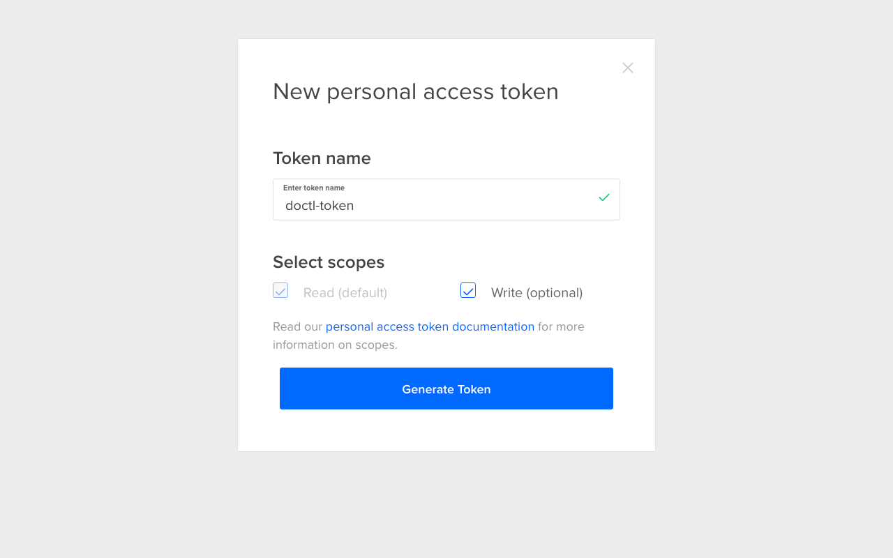
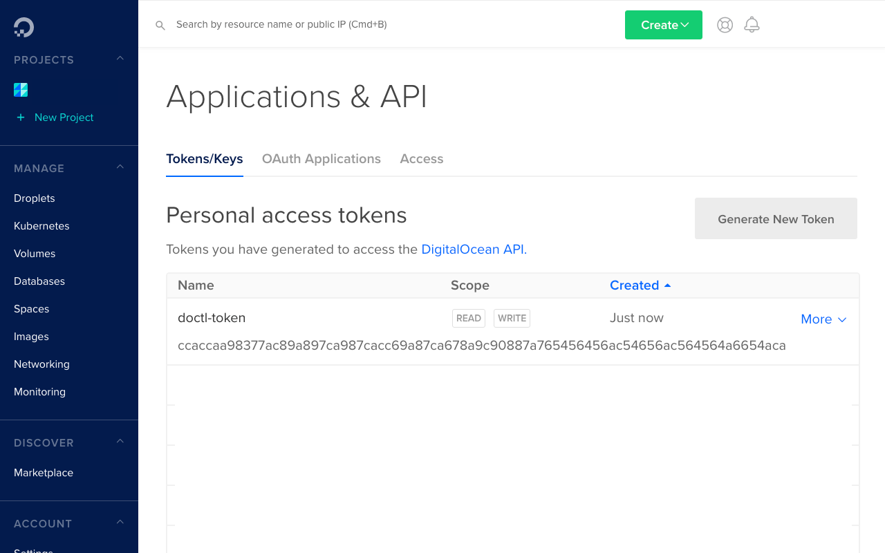
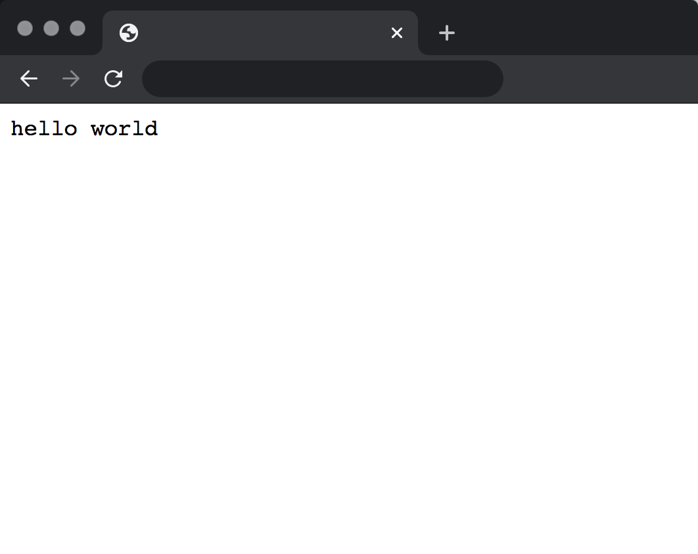

Reading my posts, it doesn't take long to see that I use Docker constantly.
One area where Docker's benefits are undeniable are in combination with Kubernetes.
According to [kubernetes.io]:

> Kubernetes (K8s) is an open-source system for automating deployment, scaling,
> and management of containerized applications.

## Why has Kubernetes become so popular?

Kubernetes is nearly synonymous with both service-oriented architecture and the
Infrastucture-as-Code pattern. These patterns really go hand-in-hand.
Service-oriented architecture means dozens (if not more) small, domain-driven
applications. Orchestrating the deployment and scale of these services is
simplified by representing their infrastructure in a version-control system like
git ("Infrastructure-as-Code").

In the past, infrastructure changes meant running specific and intricate
commands, or wrangling with complicated management interfaces. In the world of 
Infrastructure-as-Code, scaling, modifying and healing your infrastructure becomes
a matter of fiddling with YAML or JSON files. Not only does this leave 

## Steps

```toc
exclude: Why has Kubernetes become so popular\?|Steps|Conclusion
fromHeading: 1
toHeading: 2
```

## Step 1 &ndash; Prerequisites

### Sign up for a DigitalOcean account

Before starting, you need to sign up for a
[DigitalOcean (DO)](https://www.digitalocean.com/) account and add a payment method.
In this tutorial, we will create a Kubernetes cluster with a single node, which
is equivalent to a single Droplet ("Droplets" are the DO equivalent to AWS
EC2 instances). As long as you complete the cleanup, this tutorial should cost
less than $1.

### Set up DigitalOcean CLI (`doctl`)

#### Install `doctl`

Before getting started, you need to set up `doctl`. You can find installation
instructions [here](https://github.com/digitalocean/doctl#installing-doctl).

On macOS, you can use brew:

```bash
brew install doctl
```

#### Authenticate `doctl`

In order for the `doctl` tool to manage resources in your DO account, you need
to authorize it using an API key. 

Create a "Personal account token" on the "API" page of the DO dashboard, or
[click here](https://cloud.digitalocean.com/account/api/tokens/new).

+------------------------------------------------------------------------------------------------+
| Create token personal account token                                                            |
+===============================================+================================================+
|  |  |
+-----------------------------------------------+------------------------------------------------+

Copy the token once created, then run:

```bash
$ doctl auth init
DigitalOcean access token: token-above
Validating token: OK
```

### Create DO project

Now that `doctl` is installed and configured, we can create a project to contain
resources we will create.

To create a project, run the following command:

```bash
doctl projects create --name kubernetes-deploy --purpose "deploy kubernetes"
```

### Clone `kubernetes-deploy` repository

Now that `doctl` is set up, let's clone the `kubernetes-deploy` repo, which
contains commands and templates used for creating Kubernetes resources:

```bash
$ git clone git@github.com:benjaminbergstein/kubernetes-deploy.git
$ cd kubernetes-deploy
```

### Set up `kubectl`

We also need to install the `kubectl` command. Find installation instructions
[here](https://kubernetes.io/docs/tasks/tools/install-kubectl/).

Once again, if you are using macOS, you can simply use brew:

```bash
brew install kubectl
```

Test that `kubectl` has successfully installed by running:

```
$ kubectl version –client
Client Version: version.Info{Major:"1", Minor:"18", GitVersion:"v1.18.3", GitCommit:"2e7996e3e2712684bc73f0dec0200d64eec7fe40", GitTreeState:"clean", BuildDate:"2020-05-20T12:52:00Z", GoVersion:"go1.13.9", Compiler:"gc", Platform:"linux/amd64"}
```

Now we are ready to get started with our Kubernetes cluster!

## Step 2 &ndash; Create Kubernetes Cluster

The `kubernetes-deploy` repository cloned earlier includes make targets for
the rest of the tutorial. To create the cluster, simply run:

```bash
$ CLUSTER_NAME=example-cluster make -C cluster deploy
doctl k8s cluster create example-cluster \
        --auto-upgrade \
        --count 1 \
        --wait
Notice: Cluster is provisioning, waiting for cluster to be running
......
```

Then wait for the cluster to become available.

## Step 3 &ndash; Deploy Dummy Application to Kubernetes Cluster

Deploying the dummy application is achieved by invoking a make target as well:

```bash
$ PROJECT=example make -C deployments deploy
```

Now, wait for the load balancer to become available, at which point it will have
a public IP address:

```bash
$ kubectl get services
NAME                    TYPE           CLUSTER-IP      EXTERNAL-IP       PORT(S)        AGE
example-production-lb   LoadBalancer   10.XXX.XXX.XX 182.202.102.201 80:30002/TCP   3m49s
kubernetes              ClusterIP      10.XXX.XXX.XX      <none>            443/TCP        13m
```

Navigate to that IP address (http://182.202.102.201 in this case) in a web browser:



The `hashicorp/http-echo` image is now running within the
Kubernetes cluster.

If you want to dive into the YAML templates that launch the Kubernetes
LoadBalancer and Pod, take a look at deployment/example/production.yml:

#### deployment/example/production.yml

```yml
apiVersion: apps/v1
kind: Deployment
metadata:
  name: "example-production"
  namespace: default
spec:
  replicas: 1
  selector:
    matchLabels:
      example-production: web
  template:
    metadata:
      labels:
        example-production: web
    spec:
      containers:
      - name: "example-production-container"
        image: "hashicorp/http-echo"
        args: ["-listen=:8080", "-text=hello world"]
      imagePullSecrets:
      - name: regcred
---
apiVersion: v1
kind: Service
metadata:
  name: "example-production-lb"
spec:
  selector:
    example-production: web
  type: LoadBalancer
  ports:
    - port: 80
      targetPort: 8080
```

## Step 4 &ndash; Cleanup

Cleanup is again a matter of running a few make targets:

```bash
# Destroy the LoadBalancer and Pod
PROJECT=example make -C deployment destroy
# Destroy the cluster
CLUSTER_NAME=example-cluster make -C cluster destroy
```

## Step 5 &ndash; Deploy your own application!

Now that you have the ability to create a Kubernetes cluster on DigitalOcean 
infrastructure, and deploy a dockerized application to that cluster, the sky's
the limit :dizzy:!

To deploy your application, simply duplicate the `deployment/example` directory, 
modify the template to use your docker image and command. Then follow the directions
in Step 3 to deploy your application. You will need to dockerize your project.

## Conclusion

In the above guide, we deployed a single pod of a dummy application to a single-node
cluster on DigitalOcean. Kubernetes is capable of managing thousands of nodes and dozens 
of applications, so I hope this helps you take the first steps of playing with Kubernetes,
demystifying it a bit.

