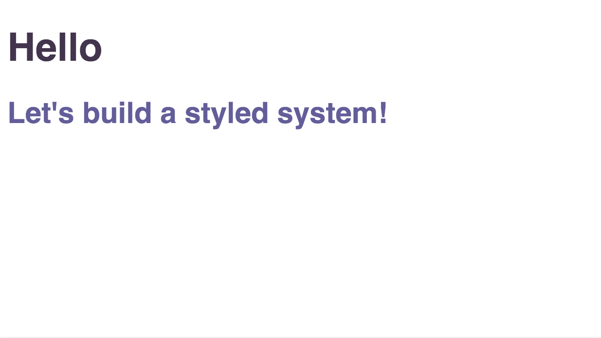
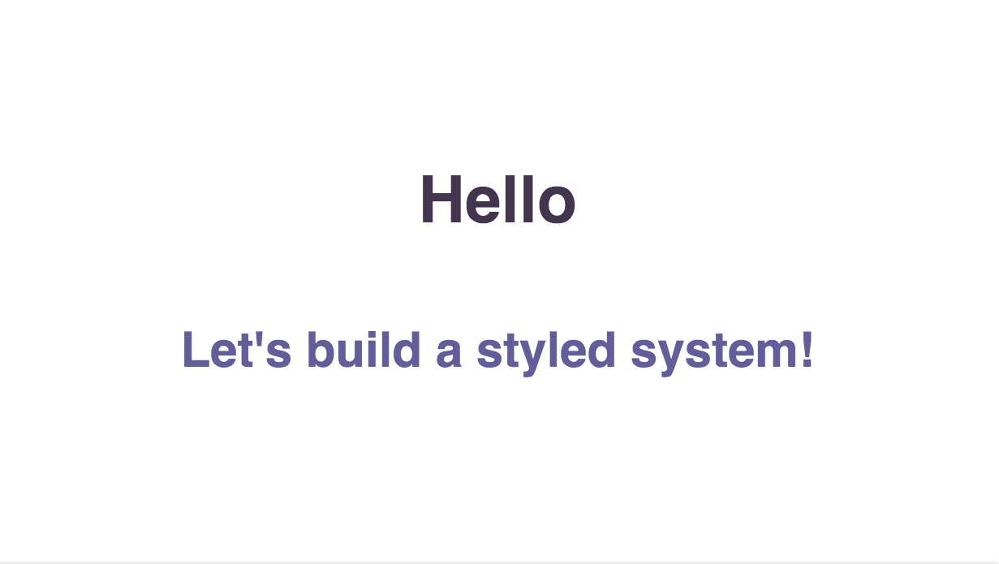
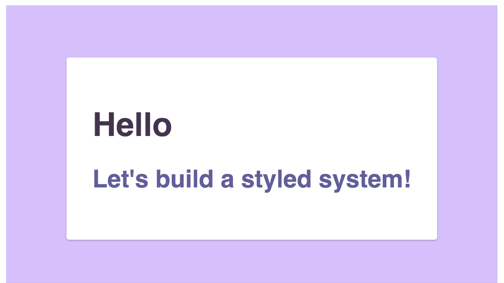

CSS framework is an important choice when building a web application. For React,
there are many choices. One approach I like a lot is
[styled-components](https://styled-components.com/). `styled-components` generates
and manages `<style>` tags on the fly, creating no standalone CSS files.

The page's CSS rides along with JS files, meaning when the Javascript bundle arrives, the page can be
rendered :boom:. The page does not block rendering while waiting for standalone CSS files to
download, parse and calculate. This can help with performance metrics such as First
Paint and Time to Interactive and prevent the dreaded FOUC (Flash of Unstyled Content).

The benefits of `styled-components` are amplified by combination with the
`styled-system` library. That is because, while `styled-components` makes it easy
to create lots of styled components (leading to a large and unweildy codebase), the
`styled-system` library simplifies creating reusable, single-responsibility
components. This allows you to rapidly build out user interfaces without writing very much
custom CSS. Instead, layout and visual design are managed by use of low level components
and their properties.

You can follow along this guide by forking [this
CodeSandbox](https://codesandbox.io/s/cranky-davinci-jj2d6?file=/src/App.tsx).
The final version can be found [here](https://codesandbox.io/s/interesting-tu-l1s1p)

## Components

In this post, I'll take a look at the following use cases:

```toc
exclude: Project set up|Components|Conclusion
fromHeading: 1
toHeading: 2
```

## \<System\> wrapper.

First, we need to set up a wrapping component to provide a theme with colors
and scales:

#### System.tsx

```typescript
import React from "react";
import styled, { ThemeProvider } from "styled-components";

const theme = {
};

const System: React.FC<{}> = ({ children }) => (
  <ThemeProvider theme={theme}>{children}</ThemeProvider>
);

export default System;
```

#### App.tsx

```diff
@@ -1,6 +1,5 @@
 import React from "react";
 import styled from "styled-components";
+import System from './System'

 const Container = styled.div`
   font-family: sans-serif;
@@ -10,11 +9,10 @@ const Container = styled.div`

 export default function App() {
   return (
-    <Container>
-      <h1>Hello</h1>
-      <h2>Let's build a styled system!</h2>
-    </Container>
+    <System>
+      <Container>
+        <h1>Hello</h1>
+        <h2>Let's build a styled system!</h2>
+      </Container>
+    </System>
   );
 }
```

## \<Text\>

Now let's add a text component. First, let's add text-related properties to our theme:

```diff
 const theme = {
+  colors: {
+    orange: "#e28413",
+    teal: "#baf2d8",
+    purple: "#44344f",
+    red: "#ef233c",
+    tan: "#fff8f0"
+  },
+  fontSizes: [12, 14, 16, 18, 20, 24, 32],
+  fontWeights: [100, 300, 500, 700, 900]
 };
```

A few colors, along with font sizes and weights.

Then we just need to configure our `<Text>` component:

#### Text.tsx

```typescript
import styled from "styled-components";
import { color, typography } from "styled-system";

export const Text = styled.span({}, color, typography);

export default Text;
```

Let's update our `<App>` component to use this `<Text>` component.

#### App.tsx

```diff
 import React from "react";
 import styled from "styled-components";
+import Text from "./Text";

 const Container = styled.div`
   font-family: sans-serif;
@@ -12,8 +13,12 @@ export default function App() {
   return (
     <System>
       <Container>
-        <h1>Hello</h1>
-        <h2>Let's build a styled system!</h2>
+        <Text as="h1" color="purple">
+          Hello
+        </Text>
+        <Text as="h2" color="teal">
+          Let's build a styled system!
+        </Text>
       </Container>
     </System>
   );
```

Now our page looks like this:



## \<Box\>

The `<Box>` component has several, mostly layout, responsibilities: spacing (margin and
padding), positioning, display and flex properties. It's also nice to include
some visual properties, such as background, border, shadow and color.

Here is what the box component looks like:

#### Box.tsx

```typescript
import styled from "styled-components";
import { space, layout, position, flexbox, background, border, shadow, color } from "styled-system";

export const Box = styled.div({}, space, layout, position, flexbox, background, border, shadow, color)

export default Box;
```

The `styled-system` library makes it simple to compose this component. Let's use
it to center our content using some flexbox properties:

#### App.tsx

```diff
 import Text from "./Text";
+import Box from "./Box";

 const Container = styled.div`
   font-family: sans-serif;
   max-width: 640px;
   margin: 0 auto;
+  height: 100%;
 `;

 export default function App() {
   return (
     <System>
       <Container>
-        <Text as="h1" color="purples.2">
-          Hello
-        </Text>
-        <Text as="h2" color="purples.1">
-          Let's build a styled system!
-        </Text>
+        <Box
+          display="flex"
+          justifyContent="center"
+          alignItems="center"
+          flexDirection="column"
+          height="100%"
+        >
+          <Text as="h1" color="purples.2">
+            Hello
+          </Text>
+          <Text as="h2" color="purples.1">
+            Let's build a styled system!
+          </Text>
+        </Box>
       </Container>
     </System>
   );
```



That's nice, but it's pretty simple. Next, let's build another layer with the
`<Card>` component.

## \<Card\>

The `<Card>` component is a `<Box>` with preset `defaultProps`:

#### Card.tsx

```typescript
import styled from "styled-components";
import Box from "./Box";

const Card = styled(Box)``;
Card.defaultProps = {
  p: 4,
  borderRadius: "3px",
  boxShadow: "0px 1px 2px 0px rgba(90, 90, 90, 0.4)"
};

export default Card;
```

There are two obscure pieces of code above I want to call out:

+-----------------------+------------------------------------------+
| `p: 4`                | `styled-components` offers shorthands    |
|                       | for padding (p) and margin (m)           |
+-----------------------+------------------------------------------+
| ```styled(Box)`` ```  | This duplicated the Box component,       |
|                       | allowing us to set custom `defaultProps` |       
+-----------------------+------------------------------------------+

Let's put it to use by  wrapping our content in a `<Card>`:

#### App.tsx

```diff
 import styled from "styled-components";
 import System from "./System";
 import Text from "./Text";
 import Box from "./Box";
+import Card from "./Card";

 const Container = styled.div`
   font-family: sans-serif;
@@ -16,18 +17,21 @@ export default function App() {
     <System>
       <Container>
         <Box
+          bg="purples.0"
           display="flex"
           justifyContent="center"
           alignItems="center"
           flexDirection="column"
           height="100%"
         >
-          <Text as="h1" color="purples.2">
-            Hello
-          </Text>
-          <Text as="h2" color="purples.1">
-            Let's build a styled system!
-          </Text>
+          <Card bg="white">
+            <Text as="h1" color="purples.2">
+              Hello
+            </Text>
+            <Text as="h2" color="purples.1">
+              Let's build a styled system!
+            </Text>
+          </Card>
         </Box>
       </Container>
     </System>
```



## Conclusion

This is only a small selection of possible components you can configure for your component library. And of course, the components you build will depend on the specific needs of your application. Of course, `<Text>`, `<Box>` and `<Card>` are very commonly used patterns, so I hope they are helpful examples.

Overall, `styled-components` and `styled-system` together is a powerful combination. The result is fast-rendering pages with consistent style. It makes it very easy to configure components you'll *want* to reuse, rather than creating a new set of styled components for every interface. It will mean less overall new CSS written and a much easier time moving components and interfaces within your project.

