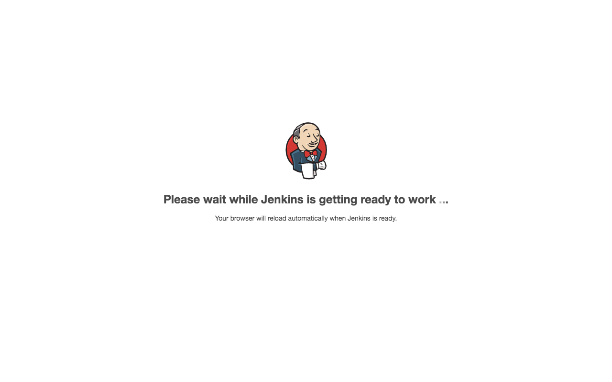

I've previously written about my
[Docker development workflow](/engineering/docker-development-with-make/). For
personal projects, I like to develop on a [Digital Ocean
Droplet](https://www.digitalocean.com/products/droplets/) over SSH. This
works well with my docker workflow, as setting up the machine to develop is as
easy as running a make target. This during periods when I am not
developing much, I can simply destroy the droplet.

However, when building a project with multiple services, such as a React client
with a GraphQL backend, it can become difficult to recall which service is
running on which public port. For the sake of convenience, I've worked out a
way to run traffic through Nginx, and use regular expressions to dynamically
route to the appropriate container. For example, a request to
`http://container.8080.mydomain.com` is routed to port 8080 on a container called
`container`.

This walkthrough assumes familiarity with [docker](https://www.docker.com/)
and [nginx](https://www.nginx.com/), and assumes you have a server running
with DNS records configured for `*.yourdomain.com`.

## Procedure

```toc
exclude: "Procedure|Conclusion"
fromHeading: 1
toHeading: 2
```

## Set up dockerized Nginx

We'll use docker-compose to configure our Nginx server for two reasons:

1) So we can use Docker networking to route traffic to our service containers
using their docker hostnames
2) Because Docker makes it very easy to spin up an Nginx container.


#### docker-compose.yml

```yaml
version: '3.7'

services:
   nginx:
      image: nginx:latest
      ports:
         - 80:80
      volumes:
         - ./config/nginx.conf:/etc/nginx/nginx.conf
         - ./data/log/nginx:/var/log/nginx
      networks:
         - default

networks:
   default:
      name: ${NETWORK}
      external: true
```

#### Makefile

```Makefile
export NETWORK=nginx-proxy

start:
	docker-compose up -d

stop:
	docker-compose down --remove-orphans

deploy-network:
	docker network create ${NETWORK}

destroy-network:
	docker network rm ${NETWORK}
```

#### config/nginx.conf

```nginx.conf
events {}

http {
  access_log /var/log/nginx/access.log;

  server {
    location / {
      return 200 "Hello, World";
    }
  }
}
```

Now run:

```bash
> make deploy-network start
docker network create nginx-proxy
56c5b05021e2303a5b45e48a114e936eed2e458f02d7a101d42a7fe519acee53
docker-compose up -d
Creating dev-proxy_nginx_1 ... done
```

And when we navigate to the url of our host:


It works! Now we need to set up the dynamic routing.

## Set up dynamic routing in Nginx config

Let's modify our nginx configuration to route requests based on each segment of
the request's host.

#### Updated config/nginx.conf
```diff
diff --git a/config/nginx.conf b/config/nginx.conf
index 7102663..2fbe752 100644
--- a/config/nginx.conf
+++ b/config/nginx.conf
@@ -1,11 +1,20 @@
 events {}
 
 http {
   access_log /var/log/nginx/access.log;
+  resolver 127.0.0.11 ipv6=off;
 
   server {
+    listen 80;
+
+    server_name   ~^(?<container>.+)\.(?<port>\d+)\..+$;
     location / {
-      return 200 "Hello, World";
+      proxy_pass "http://${container}:$port";
+
+      proxy_set_header    Host            $host;
+      proxy_set_header    X-Real-IP       $remote_addr;
+      proxy_set_header    X-Forwarded-for $remote_addr;
+      port_in_redirect off;
+      proxy_connect_timeout 300;
     }
   }
 }
```

Let's take a closer look at some key lines

### Closer look

#### Add Docker DNS resolver

> `resolver 127.0.0.11 ipv6=off;`

This tells Nginx to use docker's dns to resolve hostnames. This is key to
successfully proxying traffic to the docker containers.

#### Server name

> `server_name   ~^(?<container>.+)\.(?<port>\d+)\..+$;`

This regular expression contains two captures: container and port. These
captures will be available as variables in the rest of the server configuration.
For a  url like `foo.80.yoursite.com`, the variables will be `container=foo` and
`port=80`.


#### Proxy pass directive

> `proxy_pass "http://${container}:$port";`

This directive tells Nginx that for this server name, proxy pass to a host using
the variables captured earlier. For the earlier example, traffic will be passed
to `http://foo:80`. With docker networking, this resolve to port 80 on a
container named "foo"

### Restart nginx

Finally, we need to restart nginx after making these changes. We can use our
make targets to do this:

```bash
> make stop start
docker-compose down --remove-orphans
Stopping dev-proxy_nginx_1 ... done
Removing dev-proxy_nginx_1 ... done
Network nginx-proxy is external, skipping
docker-compose up -d
Creating dev-proxy_nginx_1 ... done
````

Great! But we need a service on the other end to test out proxy passing.

## Start a dummy service

For the purposes of this post, I'll use jenkins as an example service, as there
is a [Jenkins Docker Image](https://hub.docker.com/r/jenkins/jenkins) already
available. I chose Jenkins because it has a frontend that we can open to test
our proxy.

#### Start Jenkins in a docker container

```bash
> docker run --name jenkins --network nginx-proxy jenkins/jenkins:lts
Running from: /usr/share/jenkins/jenkins.war
...
Jenkins is fully up and running
```

Now navigate to `http://jenkins.8080.yourdomain.com`:



## Bonus: Service Subdomains

Let's look at one possible enhanced pattern for how to configure dynamic
server names.

#### Service-based routing with docker compose

```
server_name   ~^(?<service>.+)\.(?<project>.+)\.(?<port>\d+)\..+$;
proxy_pass "http://${project}_${service}_1:$port";
```

This configuration breaks out container names by service and project, for use
with docker compose. You can add this to your nginx configuration as an
additional `server {}` block for added flexibility.

When using this pattern with docker compose, you need to remember to connect it
to the same network. For our Jenkins example, this would look like this:

#### Sample docker-compose.yml for Jenkins

```yaml
version: '3.7'

services:
   jenkins:
      image: jenkins/jenkins:lts
      networks:
         - nginx-proxy

networks:
   nginx-prox:
      external: true
```

The line `external: true` tells docker that this network already exists, and
does not need to be created.

## Conclusion

In the end, it is pretty simple to set up dynamic routing to docker containers
using the above pattern. I've found it convenient, as I can simply spin up my
projects and quickly navigate in the browser, or configure communication between
services. These URLs are easier to remember than simply the domain name and a
port. I hope you found this helpful!
